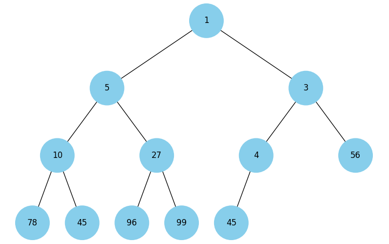
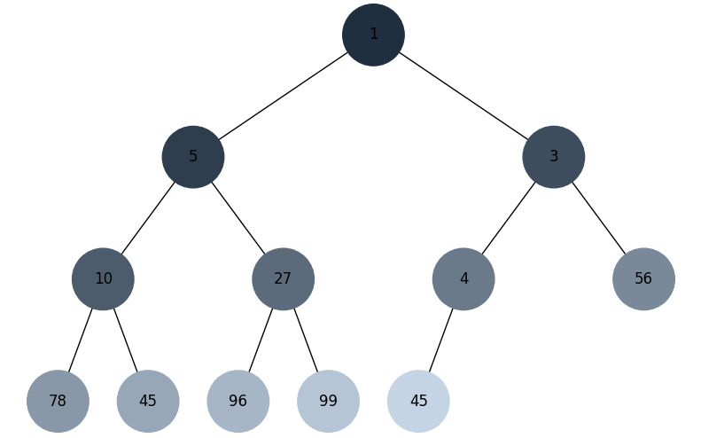
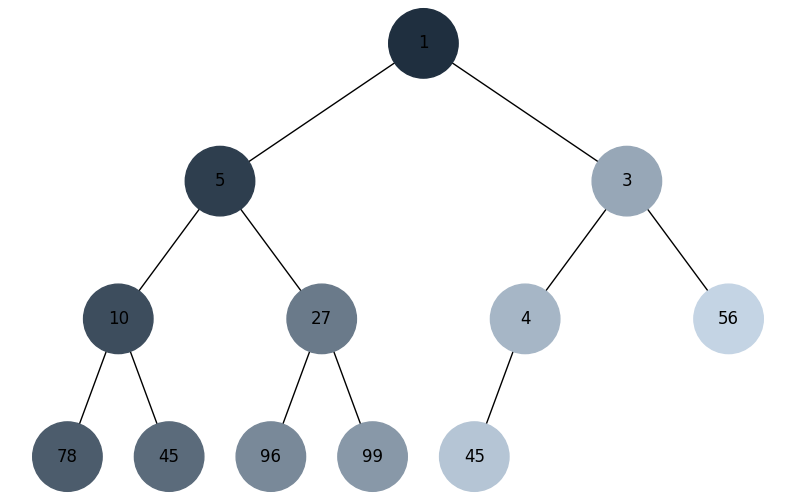

# GoIT Algo FP

## Task 1
Linked list operations: sorting with bubble sort, merging two sorted lists, and reversing.

## Task 2
Pythagorean tree visualization using recursive graphics with adjustable depth.

## Task 3
Dijkstra's algorithm using min-heap to find shortest paths in a weighted graph.

## Task 4
Converts an array to a min heap and displays it as a tree visualization.

## Task 5
Tree traversal using BFS and DFS algorithms with color visualization.

### BFS:

### DFS:

## Task 6
Knapsack problem solved using greedy algorithm and dynamic programming.

**Example with budget 100:**
- **Greedy algorithm:** 870 calories, 80 cost (suboptimal - wastes 20 budget)
  - Items: cola (220 cal), potato (350 cal), pepsi (100 cal), hot-dog (200 cal)
- **Dynamic programming (optimal):** 970 calories, 100 cost (finds true optimum)
  - Items: pizza (300 cal), pepsi (100 cal), cola (220 cal), potato (350 cal)

**Key insight:** Greedy selects by best ratio locally, DP finds the globally optimal combination.

## Task 7
Monte Carlo simulation comparing empirical vs theoretical dice roll probabilities.

**Results (1,000,000 rolls):**

| Sum | Count  | Simulated % | Theoretical % | Difference |
|-----|--------|-------------|---------------|-----------|
| 2   | 27675  | 2.77        | 2.78          | 0.01      |
| 3   | 55628  | 5.56        | 5.56          | 0.01      |
| 4   | 82734  | 8.27        | 8.33          | 0.06      |
| 5   | 110764 | 11.08       | 11.11         | 0.03      |
| 6   | 139058 | 13.91       | 13.89         | 0.02      |
| 7   | 167077 | 16.71       | 16.67         | 0.04      |
| 8   | 139519 | 13.95       | 13.89         | 0.06      |
| 9   | 110947 | 11.09       | 11.11         | 0.02      |
| 10  | 82941  | 8.29        | 8.33          | 0.04      |
| 11  | 55902  | 5.59        | 5.56          | 0.03      |
| 12  | 27755  | 2.78        | 2.78          | 0.00      |

 The simulation shows that empirical probabilities from 1 million dice rolls closely match theoretical predictions (within 0.06% difference). This demonstrates the **Law of Large Numbers** - as sample size increases, observed frequencies converge to theoretical probabilities. The peak at 7 (most likely outcome) and symmetric distribution around it match mathematical predictions.

